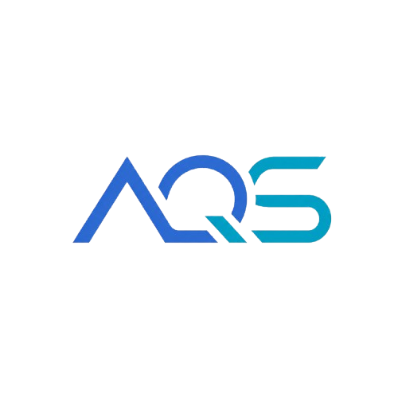

# PROY-2026-GRUPO-3

<p align="center">
  
</p>

Repositorio del grupo 3 para el proyecto del ramo *Proyecto Inicial (IWG400)* – 2026.

## 👥 Integrantes del grupo

| Nombre y Apellido | Usuario GitHub | Correo USM               | Rol USM      |
| ----------------- | -------------- | ------------------------ | ------------ |
| Lucas Fluxá       | @LucasFluxa    | lfluxa@usm.cl            | 202630017-k  |
| Bruno Olguín      | @Bruno-Olguin  | bolguinc@usm.cl          | 202630028-5  |
| Domingo Vargas    | @Domingo-07    | jvargascar@usm.cl        | 202630026-9  |
| Daniel Guerra     | @dannyto2      | dguerrap@usm.cl          | 202530020-6  |

---

## 📝 Descripción breve del proyecto

**AquaSense** es un sistema inteligente de monitoreo de acuarios que combina sensores físicos, visión por computadora y una interfaz web local. El sistema mide en tiempo real la temperatura y pH del agua, y utiliza una cámara para trackear el comportamiento de los peces, detectando signos de estrés o anomalías. Todo el procesamiento ocurre directamente en el Arduino UNO Q, sin depender de servidores externos.

El dashboard web incluye una base de datos de especies de peces con parámetros ideales de temperatura y pH, compatibilidad entre especies, y un sistema de alertas automáticas cuando los parámetros del agua salen del rango óptimo para las especies registradas.

---

## 🎯 Objetivos

- **Objetivo general:**
  - Desarrollar un sistema de monitoreo inteligente de acuarios que permita detectar condiciones adversas del agua y comportamiento anómalo de los peces en tiempo real.

- **Objetivos específicos:**
  - Medir temperatura y pH mediante sensores conectados al Arduino UNO Q.
  - Implementar tracking de movimiento de peces mediante cámara USB y visión por computadora corriendo localmente en el UNO Q.
  - Desarrollar un dashboard web hosteado en el propio Arduino UNO Q accesible desde cualquier dispositivo en la misma red.
  - Generar alertas automáticas cuando algún parámetro salga del rango ideal para las especies registradas.
  - Permitir al usuario registrar las especies de peces de su acuario y consultar su compatibilidad y parámetros ideales.

---

## 🧩 Alcance del proyecto

**Dentro del alcance:**
- Monitoreo en tiempo real de temperatura y pH
- Tracking de movimiento de peces con detección de comportamiento anómalo
- Dashboard web local con historial de datos y gráficos en tiempo real
- Base de datos de 32 especies de peces con parámetros ideales y compatibilidad entre pares
- Alertas cuando los parámetros salen del rango óptimo para las especies del acuario
- Simulador de sensores para pruebas locales sin hardware

**Fuera del alcance:**
- Control automatizado de equipos del acuario (calefactor, filtro, etc.)

---

## 🛠️ Tecnologías y herramientas utilizadas

- **Lenguaje(s) de programación:**
  - Python (dashboard web y servidor local)
  - C++ / Arduino Sketch (control en tiempo real del STM32U585)
  - JavaScript / HTML / CSS (interfaz web del dashboard)

- **Microcontroladores:**
  - Arduino UNO Q (Qualcomm Dragonwing QRB2210 + STM32U585)

- **Sensores:**
  - DS18B20 — temperatura del agua (sumergible, OneWire)
  - pH-4502C — pH del agua (analógico, con placa de acondicionamiento)
  - Webcam USB — tracking de movimiento de peces (V4L2)

- **Software y librerías:**
  - Flask — servidor web
  - Socket.IO — comunicación en tiempo real entre servidor y dashboard
  - OpenCV — captura de video y detección de movimiento
  - YOLOv8 (Ultralytics) — detección e identificación de especies *(en desarrollo)*
  - pyserial — comunicación serial STM32 → Python
  - OneWire + DallasTemperature — lectura del DS18B20
  - Chart.js — gráficos de historial de temperatura y pH

---

## 🗂️ Estructura del repositorio

```
Aquasens3/
├── assets/
│   ├── index.html          # Dashboard web (frontend completo)
│   ├── favicon.png         # Ícono del sitio
│   ├── fish_database.json  # Base de datos de 32 especies
│   ├── update_fish.json    # Compatibilidad entre pares de peces
│   └── fish_images/        # Imágenes de las especies
├── python/
│   └── main.py             # Servidor principal (Arduino UNO Q)
├── sketch/
│   └── sketch.ino          # Firmware STM32U585
├── serve_local.py          # Servidor de desarrollo local (PC)
├── logo.png                # Logo del proyecto
└── README.md
```

---

## 🚀 Instrucciones de Instalación y Uso

### Desarrollo local (sin Arduino)

1. Clonar el repositorio
2. Instalar dependencias:
   ```bash
   pip install flask flask-socketio
   ```
3. Ejecutar el servidor local:
   ```bash
   python serve_local.py
   ```
4. Abrir el navegador en `http://localhost:8080`

### Despliegue en Arduino UNO Q

> *Por definir* — pendiente de subida del firmware y configuración del entorno App Lab.

---

## 📐 Diseño del Sistema


*El STM32U585 lee los sensores de temperatura y pH y los envía al Qualcomm via comunicación interna. El Qualcomm corre Python con OpenCV para el tracking de la cámara y Flask para el dashboard web.*

---

## 📅 Cronograma de trabajo

[Carta Gantt](https://lucasfluxa.github.io/Aquasense-Grupo3/Cartagantt.html)

---

## 📚 Bibliografía

- [Arduino UNO Q — Documentación oficial](https://docs.arduino.cc/hardware/uno-q/)
- [Flask — Documentación oficial](https://flask.palletsprojects.com/)
- [OpenCV — Documentación oficial](https://docs.opencv.org/)
- [YOLOv8 (Ultralytics)](https://docs.ultralytics.com/)

---

## 📌 Notas adicionales

> - El sensor de pH requiere calibración inicial con soluciones buffer pH 4.0 y pH 7.0, y recalibración periódica.
> - La cámara USB se conecta al puerto USB-C del UNO Q mediante un USB-C HUB.
> - El sensor de turbidez TSD-10 fue descartado del alcance actual del proyecto.
> - El servidor local (`serve_local.py`) incluye un simulador de sensores accesible desde el dashboard para pruebas sin hardware.
