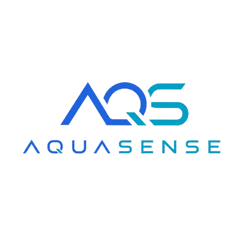
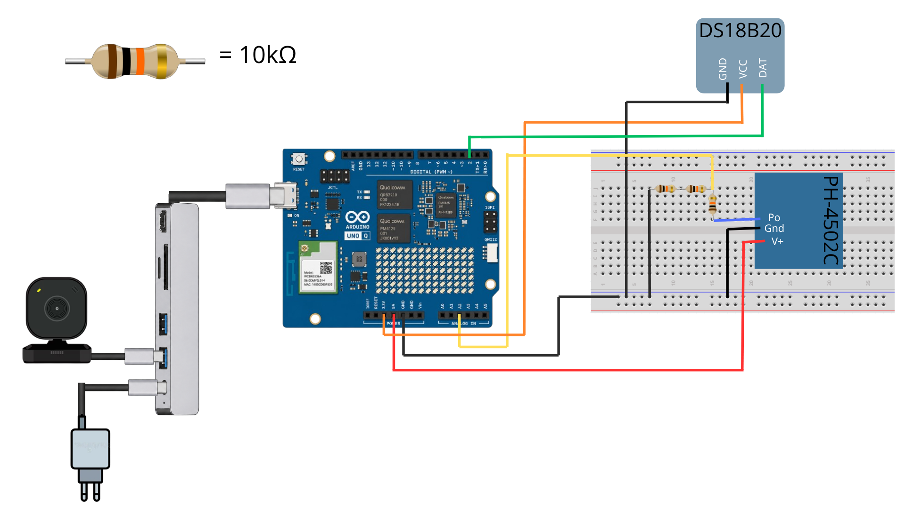

# AQUASENSE-GRUPO-3

<p align="center">
  
</p>

Repositorio del grupo 3 para el proyecto del ramo *Proyecto Inicial (IWG400)* – 2026.

## 👥 Integrantes del grupo

| Nombre y Apellido | Usuario GitHub | Correo USM               | Rol USM      |
| ----------------- | -------------- | ------------------------ | ------------ |
| Lucas Fluxá       | @LucasFluxa    | lfluxa@usm.cl            | 202630017-k  |
| Bruno Olguín      | @Bruno-Olguin  | bolguinc@usm.cl          | 202630028-5  |
| Domingo Vargas    | @Domingo-07    | jvargascar@usm.cl        | 202630026-9  |
| Daniel Guerra     | @dannyto2      | dguerrap@usm.cl          | 202530020-6  |

---
## 📝 Descripción breve del proyecto

> AquaSense es un sistema de monitoreo para acuarios que permite visualizar en una interfaz web el estado del agua en tiempo real. El proyecto mide temperatura y pH mediante sensores conectados a un Arduino UNO Q, envía las lecturas a un backend en Python usando Bridge RPC y las muestra en un dashboard accesible desde la misma red. Además, incluye una base de datos de peces para revisar si las especies seleccionadas se encuentran dentro de los rangos recomendados de temperatura y pH, junto con reglas de compatibilidad entre especies.

---

## 🎯 Objetivos

- Objetivo general:
  - Desarrollar un sistema funcional de monitoreo para acuarios que entregue información clara sobre temperatura, pH y compatibilidad básica de especies desde un dashboard web.
- Objetivos específicos:
  - Medir la temperatura del agua con un sensor DS18B20.
  - Medir el pH del agua con un sensor PH-4502C.
  - Enviar las lecturas desde el Arduino al backend Python mediante Bridge RPC.
  - Mostrar los datos en tiempo real en un dashboard web local.
  - Registrar un historial visual de temperatura y pH.
  - Permitir que el usuario seleccione especies de peces para evaluar rangos recomendados y compatibilidad.
  - Integrar una vista de cámara USB cuando el entorno de App Lab disponga del módulo correspondiente.

---

## 🧩 Alcance del proyecto

> El proyecto cubre la lectura de sensores de temperatura y pH, la comunicación entre Arduino y Python, la publicación de una interfaz web local, la visualización de datos en tiempo real, el historial de lecturas y una revisión informativa de compatibilidad de especies según una base de datos local. Queda fuera del alcance el control automático de actuadores como calefactores, filtros, bombas o dosificadores, la calibración profesional del sensor de pH, el almacenamiento histórico persistente en una base de datos externa y el acceso remoto fuera de la red local.

---

## 🛠️ Tecnologías y herramientas utilizadas

- Lenguaje(s) de programación:
  - Python
  - JavaScript
  - HTML/CSS
  - C++/Arduino
- Microcontroladores
  - Arduino UNO Q
- Sensores
  - DS18B20 para temperatura
  - PH-4502C para pH
- Librerías y herramientas:
  - Arduino RouterBridge / Bridge RPC
  - OneWire
  - DallasTemperature
  - WebUI brick con FastAPI, uvicorn y Socket.IO
  - Chart.js para gráficos del dashboard
  - App Lab

---

## 🗂️ Estructura del repositorio

```
/AquaSense
│
├── assets/             # Dashboard web, base de datos de peces, reglas de compatibilidad e imágenes
├── bricks/             # Brick WebUI utilizado para servir la interfaz y APIs
├── python/             # Backend Python principal
├── sketch/             # Sketch Arduino y configuración de librerías
├── README.md           # Resumen técnico del proyecto
└── READMEguia.md       # Guía/documentación del proyecto
```

---

## 🚀 Instrucciones de Instalacion y Uso


1. **Clonar el repositorio:** `git clone <url-del-repositorio>`
2. **Dependencias:** Instalar o verificar las librerías del sketch indicadas en `sketch/sketch.yaml`: `DallasTemperature (4.0.6)` y `OneWire (2.3.8)`. En App Lab se utilizan los módulos de Arduino para `App`, `Bridge` y `WebUI`.
3. **Ejecución:** Conectar los sensores al Arduino UNO Q, ejecutar la app principal desde `python/main.py` y abrir el dashboard desde un equipo en la misma red usando `http://<ip-del-dispositivo>:7000/`.

---

## 📐 Diseño del Sistema


*El sistema conecta el sensor DS18B20 al pin D2 para medir temperatura y el módulo PH-4502C al pin A2 para medir pH. El sketch de Arduino toma lecturas periódicas y las envía al backend Python mediante Bridge RPC. El backend expone APIs REST y eventos en tiempo real para que el dashboard web muestre el estado del acuario, historial de lecturas, especies seleccionadas, alertas de rango y vista de cámara cuando esté disponible.*

---

## 📅 Cronograma de trabajo

[Carta Gantt](https://lucasfluxa.github.io/Aquasense-Grupo3/Cartagantt.html)

---

## 📚 Bibliografía

- [Documentación Arduino](https://docs.arduino.cc/)
- [DallasTemperature](https://github.com/milesburton/Arduino-Temperature-Control-Library)
- [OneWire](https://www.pjrc.com/teensy/td_libs_OneWire.html)
- [Chart.js](https://www.chartjs.org/docs/latest/)
- [FastAPI](https://fastapi.tiangolo.com/)
- [Socket.IO](https://socket.io/docs/v4/)

---

## 📌 Notas adicionales

> El sensor PH-4502C debe calibrarse con sus potenciómetros antes de usar las alertas de pH como referencia fina. Si el DS18B20 no viene en módulo, se debe agregar una resistencia pull-up de 4.7 kOhm entre DATA y 3V3. El dashboard está pensado para usarse dentro de la misma red local y las alertas de compatibilidad son informativas, no reemplazan una evaluación especializada del cuidado de cada especie.
